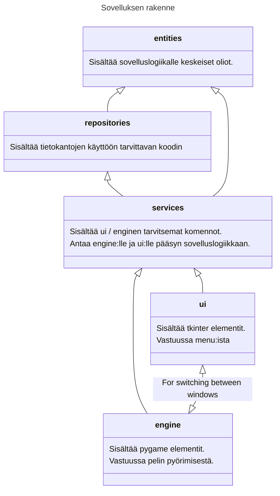
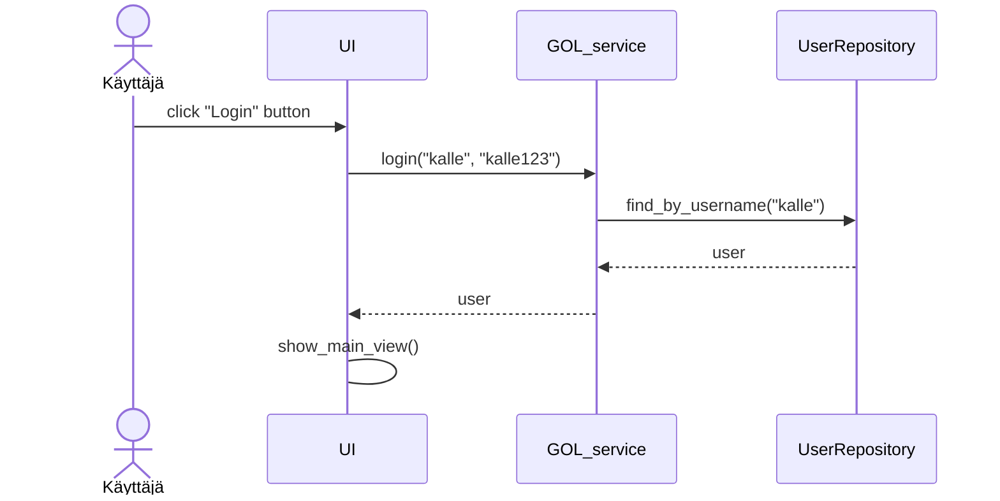
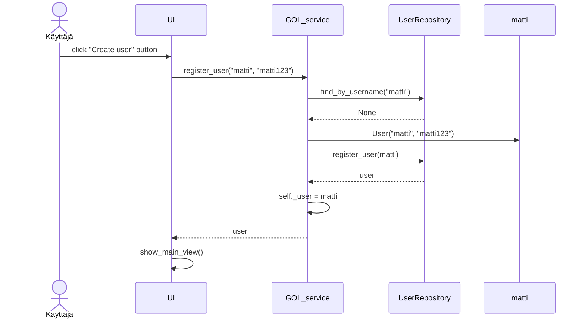
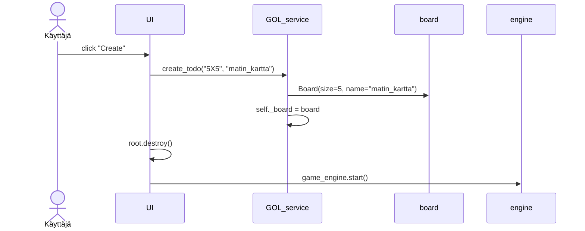

# Arkkitehtuurikuvaus

## Rakenne

## Käyttöliittymä

Käyttöliittymä(t) on jaettu kahteen
- tkinter pohjaiset menu näkymät 
- pygame pohjainen peli näkymä

## Sovelluslogiikka

## Tietojen pysyväistallennus

### Tiedostot

## Päätoiminnallisuudet

### Käyttäjän kirjaantuminen

### Uuden käyttäjän luominen

### Kartan luominen

### Muut toiminnallisuudet

## Ohjelman rakenteeseen jääneet heikkoudet

### Käyttöliittymä

