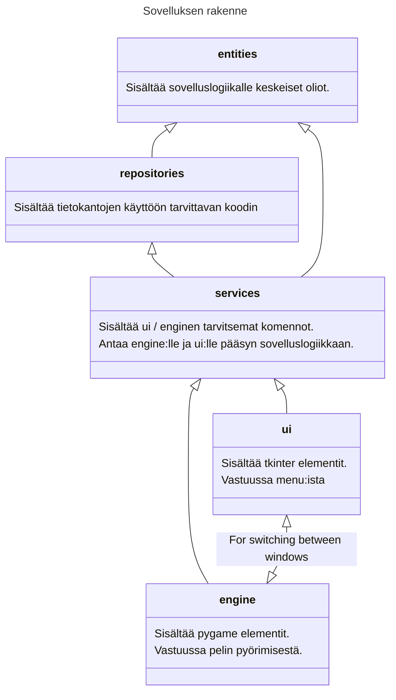
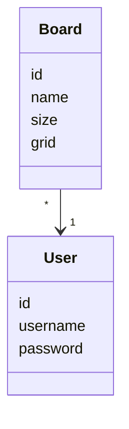
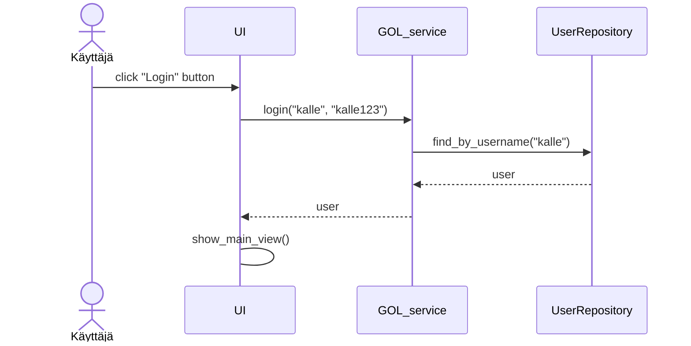
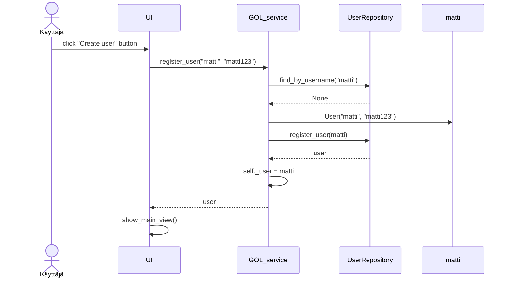
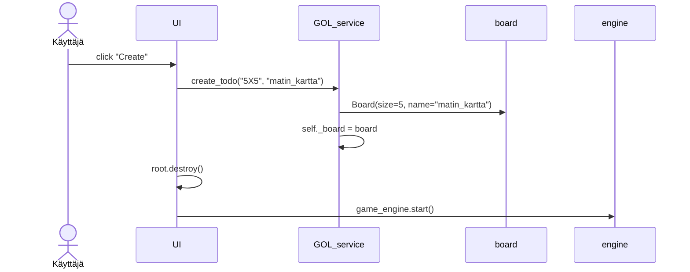
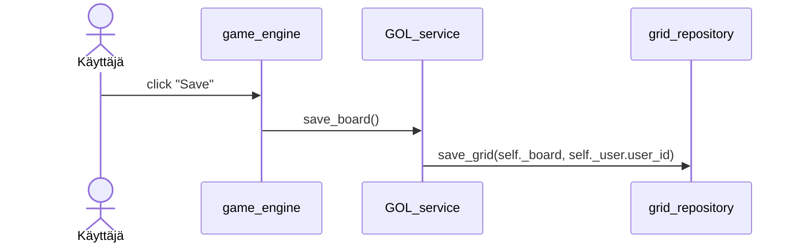
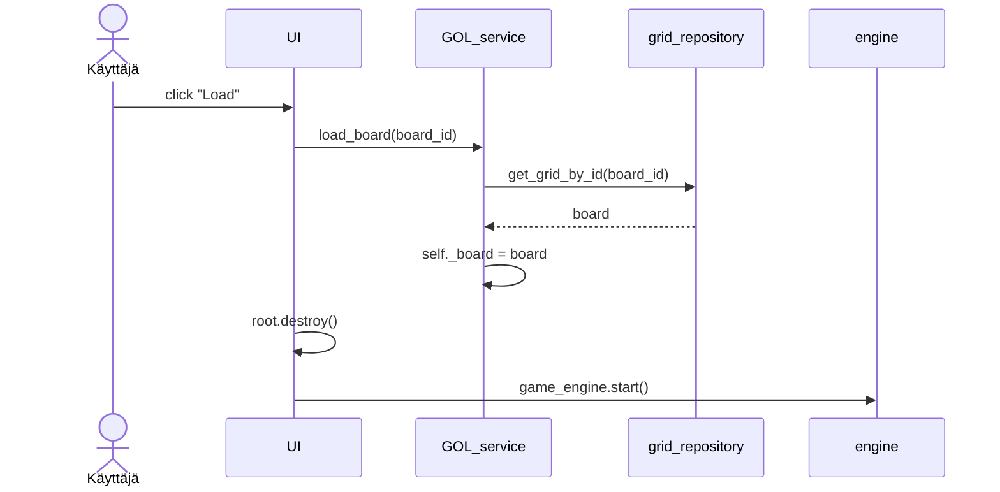
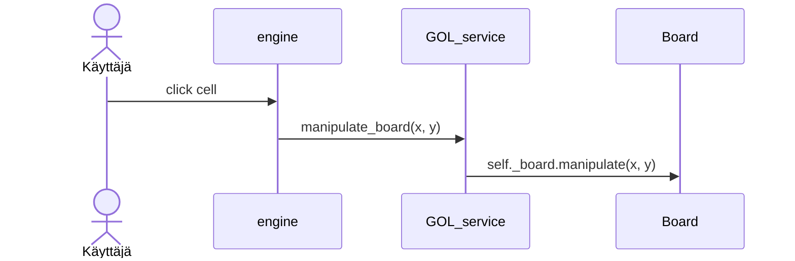

# Arkkitehtuurikuvaus

## Rakenne

Ohjelma on toteutettu käyttäen kolmitasoista kerrosarkkitehtuuria. Tätä hieman sotkee UI:n ja game_enginen verrattavissa olevat roolit, sillä kummatkin ovat vastuussa käyttöliittymästä.


## Käyttöliittymä

Käyttöliittymä(t) on jaettu kahteen
- tkinter pohjaiset menu näkymät 
- pygame pohjainen peli näkymä

Tkinter pohjaisissa menu näkymissä jokainen sivu on jaettu omaan luokkaansa sekä tiedostoonsa. Nämä ovat hyvin eristettyhä sovelluslogiikasta.

Pygamepohjaisessa game_engine luokassa on ollut pakko sotkea hieman toiminnallisuutta ja käyttöliittymää. Toiminnallisuutta täältä löytyy pelin askeltamisen nopeuden hallinta sekä zoomauksen että liikkumisen hallinta, jotka olisivat kaikki hankala toteuttaa muualla.


## Sovelluslogiikka



Toiminnallisista kokonaisuuksista vastaa luokka GOLService josta löytyy kaikille UI:n ja enginen pääfunktioille omat metodit. Tällä oliolla saavutetaan myös tiedonsiirto UI:n ja enginen välillä. Käytännössä kaikki käyttöliittymät ovat portaaleita joiden kautta käyttäjä manipuloi GOLServices olion atribuutteja.

## Tietojen pysyväistallennus

Pakkauksen repositories luokat GridRepository ja UserRepository huolehtivat tietojen tallettamisesta. Kummatkin luokat tallentavat tiedot SQLite-tietokantaan.

UserRepository:n tallentaa tiedot täsmälleen siinä muodossa kun ne ovat User luokassa, mutta GridRepository pakkaa Board objektin grid atribuutin tiedon tekstijonoksi str(grid) komennolla ennen tietokantaan pakkaamista. Kun GridRepositorystä pyydetään tietoa se purkaa kyseiset tekstijonot takaisin matriiseiksi. Board olion size atribuutti jätetään myös tallentamatta, sillä se voidaan helposti laskea Board olion grid atribuutin pituudesta.

## Päätoiminnallisuudet

Alla on kuvattu sovelluksen päätoiminnallisuutta sekvenssikaaviona.

### Käyttäjän kirjaantuminen





### Uuden käyttäjän luominen




### Kartan luominen



### Kartan tallennus



### Kartan lataaminen



### Kartan manipulointi



### Muut toiminnallisuudet


## Ohjelman rakenteeseen jääneet heikkoudet

### Käyttöliittymä

Ohjelman käyttöliittymä on jaoteltu selkeästi kahteen eri osaan. Olisi kuitenkin suoraviivaisempaa tehdä se vain yhdellä moduulilla.

### Engine

Engine luokka on liian iso ja pitkä. Se pitäisi refactoroida useampaan pienempään luokkaan.

### Errorit

Ohjelma kykenee käsittelemään hyvin rajallisen määrän erroreita. Myönnettäköön että kyseiset errorit ovat juuri ne jotka käyttäjä voi saada aikaiseksi. Laajempi erroreitten käsittely kuitenkin olisi hyödyllistä.

**HUOM:** pylintrc muokattu rivilla 171. Lisäys generated-members=pygame.* tehty, koska muuten pylint valitti että

```sh
src/engine.py:208:29: E1101: Module 'pygame' has no 'QUIT' member (no-member)
src/engine.py:209:16: E1101: Module 'pygame' has no 'quit' member (no-member)
src/engine.py:210:29: E1101: Module 'pygame' has no 'MOUSEBUTTONDOWN' member (no-member)
src/engine.py:219:29: E1101: Module 'pygame' has no 'KEYDOWN' member (no-member)
src/engine.py:219:61: E1101: Module 'pygame' has no 'K_SPACE' member (no-member)
src/engine.py:231:12: E1101: Module 'pygame' has no 'quit' member (no-member)
src/engine.py:260:16: E1101: Module 'pygame' has no 'K_a' member (no-member)
src/engine.py:262:16: E1101: Module 'pygame' has no 'K_d' member (no-member)
src/engine.py:264:16: E1101: Module 'pygame' has no 'K_s' member (no-member)
src/engine.py:266:16: E1101: Module 'pygame' has no 'K_w' member (no-member)
```
