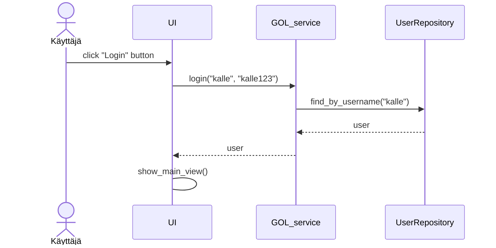
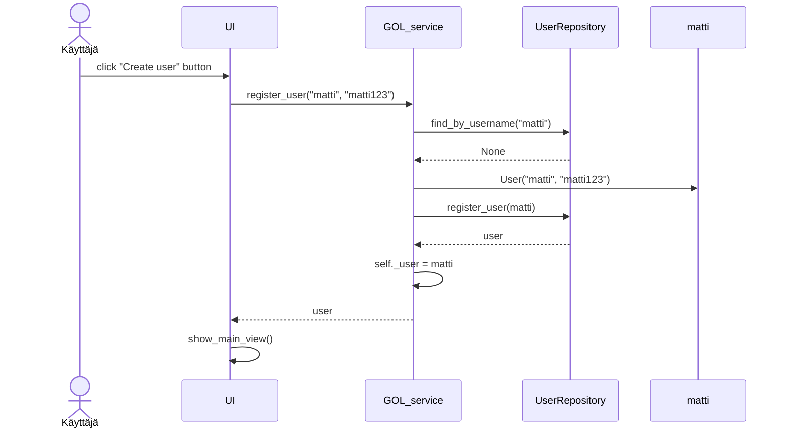
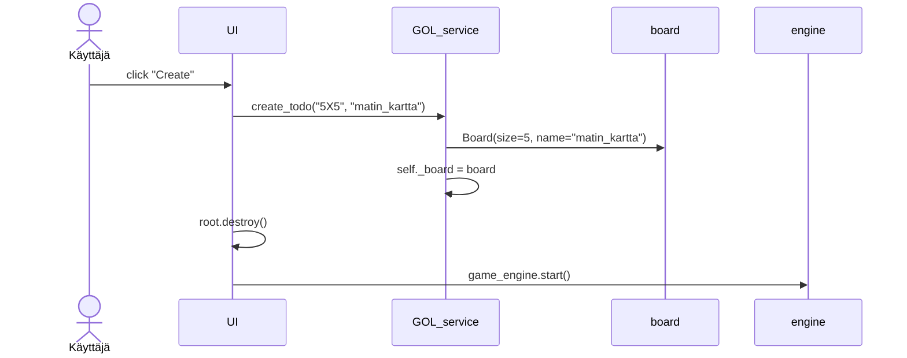

# Arkkitehtuurikuvaus

## Rakenne

´

## Käyttöliittymä

´

## Sovelluslogiikka

## Tietojen pysyväistallennus

### Tiedostot

## Päätoiminnallisuudet

### Käyttäjän kirjaantuminen

### Uuden käyttäjän luominen

### Kartan luominen

[Tapahtumakäsittelijä](https://github.com/ohjelmistotekniikka-hy/python-todo-app/blob/master/src/ui/todos_view.py#L106) kutsuu sovelluslogiikan metodia [create_todo](https://github.com/ohjelmistotekniikka-hy/python-todo-app/blob/master/src/services/todo_service.py#L49) antaen parametriksi luotavan työn tiedot. Sovelluslogiikka luo uuden `Todo`-olion ja tallettaa sen kutsumalla `TodoRepository`:n metodia `create`. Tästä seurauksena on se, että käyttöliittymä päivittää näytettävät todot kutsumalla omaa metodiaan `initialize_todo_list`.

### Muut toiminnallisuudet

Sama periaate toistoo sovelluksen kaikissa toiminnallisuuksissa, käyttöliittymän tapahtumakäsittelijä kutsuu sopivaa sovelluslogiikan metodia, sovelluslogiikka päivittää todojen tai kirjautuneen käyttäjän tilaa. Kontrollin palatessa käyttäliittymään, päivitetään tarvittaessa todojen lista sekä aktiivinen näkyvä.

## Ohjelman rakenteeseen jääneet heikkoudet

### Käyttöliittymä

Graafisen käyttöliittymän koodissa on jonkin verran toisteisuuttaa, josta voisi toteuttaa omia komponenttejaan. Esimerkiksi pylint ilmoittaa toisteisesta koodista luokissa [CreateUserview](https://github.com/ohjelmistotekniikka-hy/python-todo-app/blob/master/src/ui/create_user_view.py) ja [LoginView](https://github.com/ohjelmistotekniikka-hy/python-todo-app/blob/master/src/ui/login_view.py).